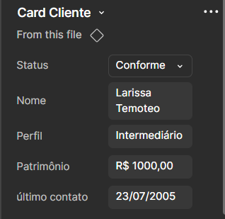

# Projeto de Componente de Interface para App Mobile
&emsp;Este projeto consiste na criação de um componente de interface para um aplicativo mobile, utilizando o Figma para o design e React Native ou HTML e CSS para a implementação. O objetivo é criar um protótipo componentizado, com Auto Layout, conteúdo mockado e alta fidelidade.

## Integrantes do Grupo
- Larissa Temoteo
- Tainá de Paiva Cortez

## Componente no Figma

&emsp;O componente foi projetado no Figma, utilizando Auto Layout para garantir que o design seja responsivo e adaptável a diferentes tamanhos de tela. O conteúdo foi mockado, evitando o uso de Lorem Ipsum, para proporcionar uma melhor visualização do omponente em uso.

&emsp;Link para o protótipo no Figma: [Protótipo Figma](https://www.figma.com/design/xLPX15i40jijzkBAkJtJA6/Pondera-Ux--Larissa-e-Tain%C3%A1?node-id=6-3&t=rsymjRsKu8OuaEPD-1)

<div style="text-align: center;">
    
    <p>Protótipo do componente no Figma</p>
</div>

<div style="text-align: center;">
    
    <p>Propriedades do componente no Figma</p>
</div>
&emsp;Este componente foi projetado para ser utilizado em um aplicativo de investimentos, apresentando informações relevantes como o perfil do investidor, o valor investido e o nome da pessoa. O design prioriza a clareza e a organização dos dados, facilitando a visualização e a interação do usuário com as informações financeiras.

&emsp;Além disso, foram criadas variações do componente para diferentes cenários de uso, tornando-o mais flexível e reutilizável. Também foram utilizadas variáveis no Figma para facilitar a componentização e permitir ajustes rápidos nas propriedades do componente, promovendo maior eficiência no desenvolvimento e manutenção.

## Layers e Estilos Organizados

&emsp; As camadas e estilos foram organizados de forma a facilitar a navegação e a compreensão do design. Todos os layers estão nomeados corretamente, seguindo uma nomenclatura clara e intuitiva. Além disso, foram utilizados estilos salvos para garantir a consistência visual em todo o componente.

<div style="text-align: center;">
    
    <p>Estilos salvos no Figma</p>
</div>

&emsp;Foram criados estilos para as cores, para que o Figma esteja sempre atualizado com as cores do projeto.

## Uso do Dev Mode
&emsp;O Dev Mode foi utilizado para inspecionar medidas, coletar estilos e gerar o código base do componente. Isso garantiu que a implementação fosse fiel ao layout projetado, minimizando a necessidade de ajustes manuais.

<div style="text-align: center;">
    
    <p>Dev Mode no Figma</p>
</div>

## Codificação Fiel ao Layout

&emsp;O componente foi implementado utilizando HTML e CSS, seguindo as diretrizes do design criado no Figma. O código foi estruturado de forma a garantir a legibilidade e a manutenibilidade, com comentários explicativos para facilitar a compreensão.

&emsp;Abaixo está o código HTML e CSS do componente, que foi desenvolvido com base no layout projetado no Figma:
```html
<div data-status="Conforme" style="width: 287px; padding-left: 16px; padding-right: 16px; padding-top: 8px; padding-bottom: 8px; background: #FCF7ED; border-radius: 30px; flex-direction: column; justify-content: flex-start; align-items: flex-start; gap: 3px; display: inline-flex">
  <!-- Linha superior: nome e status -->
  <div style="align-self: stretch; justify-content: space-between; align-items: flex-start; display: inline-flex">
    <!-- Nome do usuário -->
    <div style="flex: 1 1 0; height: 18px; justify-content: center; display: flex; flex-direction: column; color: black; font-size: 20px; font-family: Roboto; font-weight: 600; word-wrap: break-word">Larissa Temoteo</div>
    <!-- Status visual -->
    <div style="width: 79px; height: 22px; position: relative">
      <!-- Fundo colorido do status -->
      <div style="width: 79px; height: 22px; left: 0px; top: 0px; position: absolute; background: #24A49D; border-radius: 30px"></div>
      <!-- Texto do status -->
      <div style="width: 74px; height: 12px; left: 2.60px; top: 5px; position: absolute; text-align: center; justify-content: center; display: flex; flex-direction: column; color: white; font-size: 14px; font-family: Roboto; font-weight: 600; word-wrap: break-word">Conforme</div>
    </div>
  </div>
  <!-- Linha do perfil -->
  <div style="align-self: stretch; justify-content: flex-start; align-items: center; gap: 2px; display: inline-flex">
    <div style="justify-content: center; display: flex; flex-direction: column; color: black; font-size: 12px; font-family: Roboto; font-weight: 400; word-wrap: break-word">Perfil:</div>
    <div style="width: 168.35px; height: 11px; justify-content: center; display: flex; flex-direction: column; color: black; font-size: 12px; font-family: Roboto; font-weight: 400; word-wrap: break-word">Intermediário</div>
  </div>
  <!-- Linha do investimento total -->
  <div style="justify-content: flex-start; align-items: center; gap: 4px; display: inline-flex">
    <div style="color: black; font-size: 12px; font-family: Roboto; font-weight: 400; word-wrap: break-word">Investimento Total:</div>
    <div style="color: black; font-size: 12px; font-family: Roboto; font-weight: 400; word-wrap: break-word">R$ 1000,00</div>
  </div>
  <!-- Linha do último contato -->
  <div style="justify-content: flex-start; align-items: center; gap: 4px; display: inline-flex">
    <div style="color: black; font-size: 12px; font-family: Roboto; font-weight: 400; word-wrap: break-word">Último Contato:</div>
    <div style="color: black; font-size: 12px; font-family: Roboto; font-weight: 400; word-wrap: break-word">23/07/2005</div>
  </div>
</div>
```

&emsp;A imagem abaixo apresenta o resultado final da implementação do componente em HTML/CSS, demonstrando como o layout projetado no Figma foi fielmente reproduzido na interface web.

<div style="text-align: center;">
    
    <p>Visualização do componente implementado em HTML/CSS</p>
</div>

# Conclusão

&emsp;O componente foi projetado no Figma, com Auto Layout e conteúdo mockado, e implementado em HTML/CSS de forma fiel ao layout original. A organização das camadas e estilos, bem como o uso do Dev Mode, contribuíram para a eficiência do processo de desenvolvimento.

&emsp;No início, houve dificuldades para trabalhar com a criação e organização dos componentes no Figma, especialmente para entender como estruturar e reutilizar elementos de forma eficiente. Com o tempo e a prática, foi possível superar esses desafios, tornando o processo mais fluido e compreendendo melhor os recursos da ferramenta.

